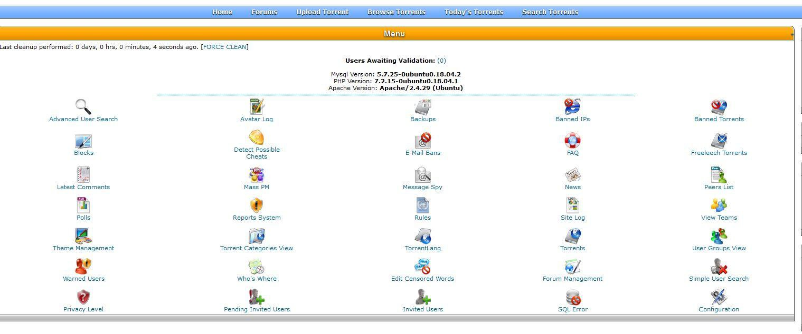

## 📢 TorrentTrader 3.0 Release

TorrentTrader 2.8 has been upgraded to **TorrentTrader 3.0**, featuring:

- ✅ Updated to use **MySQLi**
- ✅ Compatible with **PHP 7.4**
- ⚠️ **Not yet tested on PHP 8+** — feel free to test and report any issues!

For debugging, code has been added to the top of `backend/functions.php`.  
Just **uncomment** the relevant lines to enable it.

---



# Recommended: Configure PHPMailer for your project to send emails using Gmail Secure Apps. You need to have 2 Factor Auth turned on in your gmail account that you are using. If you dont have this turned on, you will not be able to do this

## Step 1: Install PHPMailer using Composer

Install PHPMailer into your `backend/` directory. This guide assumes you're using **Ubuntu**, but it may work on other Linux distros too.

First, install [Composer](https://getcomposer.org/) if you haven’t already. You can Google how to install it for your system.

Then SSH into your server:

```bash
cd /var/www/yoursitefolder/backend/
```
Run this command while in the backend folder
```bash
composer require phpmailer/phpmailer
```

> **Note:** If you get a "permission denied" error, you may need to temporarily change ownership:
>
> ```bash
> sudo chown -R $USER:www-data /var/www/yoursitefolder
> ```
>
> After installation, you can revert it:
>
> ```bash
> sudo chown -R www-data:www-data /var/www/yoursitefolder
> ```

---

## Step 2: Update `config.php`

Replace your current mail settings with:

```php
// BELOW IS PHPMAILER SETTINGS
$site_config["mail_type"] = "phpmailer";
$site_config["mail_smtp_host"] = "smtp.gmail.com";
$site_config["mail_smtp_port"] = 587; // Use 587 for TLS (465 is for SSL)
$site_config["mail_smtp_ssl"] = true;
$site_config["mail_smtp_auth"] = true;
$site_config["mail_smtp_user"] = "yourmail@gmail.com"; // Your Gmail address
$site_config["mail_smtp_pass"] = "16characterswithnospaces"; // Gmail App Password (not your login password)
```

---

## Step 3: Replace `backend/mail.php`

Replace the entire contents of `backend/mail.php` with the following:

```php
<?php
// Require Composer's autoloader for PHPMailer
require 'vendor/autoload.php';

use PHPMailer\PHPMailer\PHPMailer;
use PHPMailer\PHPMailer\SMTP;

$GLOBALS["TTMail"] = new TTMail;

class TTMail {
    var $type;
    var $smtp_host;
    var $smtp_port;
    var $smtp_ssl;
    var $smtp_auth;
    var $smtp_user;
    var $smtp_pass;

    function __construct() {
        GLOBAL $site_config;

        // Initialize defaults
        $this->type = "php"; // Fallback to PHP mail
        $this->smtp_host = "";
        $this->smtp_port = 0;
        $this->smtp_ssl = false;
        $this->smtp_auth = false;
        $this->smtp_user = "";
        $this->smtp_pass = "";

        if (isset($site_config["mail_type"])) {
            switch (strtolower($site_config["mail_type"])) {
                case "pear":
                    $this->type = "pear";
                    $this->smtp_host = $site_config["mail_smtp_host"];
                    $this->smtp_port = $site_config["mail_smtp_port"];
                    $this->smtp_ssl = $site_config["mail_smtp_ssl"];
                    $this->smtp_auth = $site_config["mail_smtp_auth"];
                    $this->smtp_user = $site_config["mail_smtp_user"];
                    $this->smtp_pass = $site_config["mail_smtp_pass"];
                    if (!@include_once("Mail.php")) {
                        trigger_error("PEAR Mail not installed.", E_USER_WARNING);
                        $this->type = "php";
                    }
                    break;
                case "phpmailer":
                    $this->type = "phpmailer";
                    $this->smtp_host = $site_config["mail_smtp_host"];
                    $this->smtp_port = $site_config["mail_smtp_port"];
                    $this->smtp_ssl = $site_config["mail_smtp_ssl"];
                    $this->smtp_auth = $site_config["mail_smtp_auth"];
                    $this->smtp_user = $site_config["mail_smtp_user"];
                    $this->smtp_pass = $site_config["mail_smtp_pass"];
                    break;
                case "php":
                default:
                    $this->type = "php";
            }
        }

        if ($this->type === "phpmailer" && (empty($this->smtp_user) || empty($this->smtp_pass))) {
            trigger_error("SMTP username or password not provided in config.", E_USER_WARNING);
            $this->type = "php";
        }
    }

    function Send($to, $subject, $message, $additional_headers = "", $additional_parameters = "") {
        GLOBAL $site_config;

        if (preg_match("!^From:(.*)!m", $additional_headers, $matches)) {
            $from = trim($matches[1]);
        } else {
            $from = $site_config["SITEEMAIL"] ?? $this->smtp_user;
        }

        $additional_headers = preg_replace("!^From:(.*)!m", "", $additional_headers);
        $additional_headers .= "\nFrom: $from\nReturn-Path: $from";
        $additional_headers = trim($additional_headers);
        $additional_headers = preg_replace("!\n+!", "\n", $additional_headers);

        switch ($this->type) {
            case "pear":
                $headers = ["From" => $from, "Return-Path" => $from, "To" => $to, "Subject" => $subject];
                $params = [
                    "host" => $this->smtp_host,
                    "port" => $this->smtp_port,
                    "auth" => $this->smtp_auth,
                    "username" => $this->smtp_user,
                    "password" => $this->smtp_pass,
                ];
                $smtp = Mail::Factory("smtp", $params);
                $smtp->send($to, $headers, $message);
                break;

            case "phpmailer":
                $mail = new PHPMailer(true);
                try {
                    $mail->isSMTP();
                    $mail->Host = $this->smtp_host;
                    $mail->Port = $this->smtp_port;
                    $mail->SMTPSecure = PHPMailer::ENCRYPTION_STARTTLS;
                    $mail->SMTPAuth = $this->smtp_auth;
                    $mail->Username = $this->smtp_user;
                    $mail->Password = $this->smtp_pass;
                    $mail->SMTPDebug = SMTP::DEBUG_OFF;

                    $mail->setFrom($from);
                    $mail->addAddress($to);
                    $mail->Subject = $subject;
                    $mail->Body = $message;

                    $mail->send();
                } catch (Exception $e) {
                    trigger_error("PHPMailer Error: " . $mail->ErrorInfo, E_USER_WARNING);
                }
                break;

            case "php":
                @mail($to, $subject, $message, $additional_headers, $additional_parameters);
                break;
        }
    }
}

function sendmail($to, $subject, $message, $additional_headers = "", $additional_parameters = "") {
    $GLOBALS["TTMail"]->Send($to, $subject, $message, $additional_headers, $additional_parameters);
}

// Optional test line. Uncomment this line to test but note that it will send emails in rapid fashion repeatedly if
// all of your settings are correct. Leave commented unless testing
// sendmail("email@somesite.com", "Test", "This is a test email from Gmail!"); Add your email to the test line
?>
```

---

## Step 4: Set Up Gmail App Password

Go to [https://myaccount.google.com](https://myaccount.google.com), type **"app password"** into the search bar, and create a new app password. DO NOT use the password that logs into the email account

Google will give you a 16-character password **with spaces**. Remove the spaces and use it as your `mail_smtp_pass` in `config.php`.

> **Example:**
> ```text
> abcd efgh ijkl mnop → "abcdefghijklmnop"
> ```
